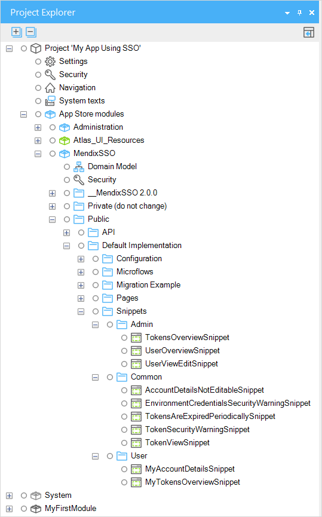
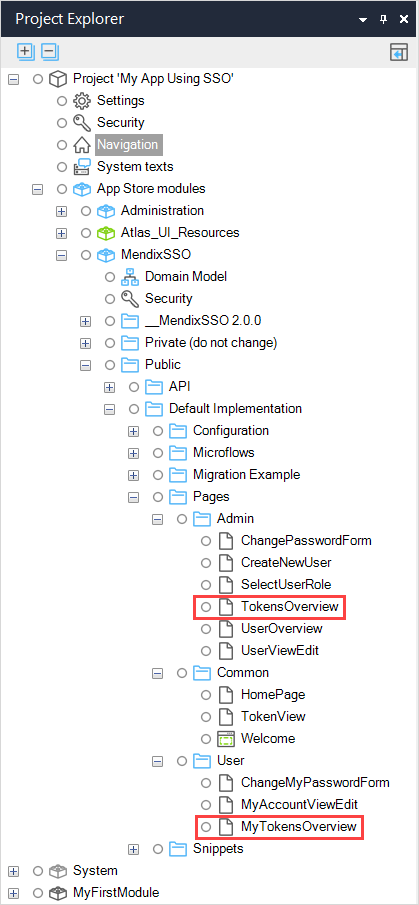
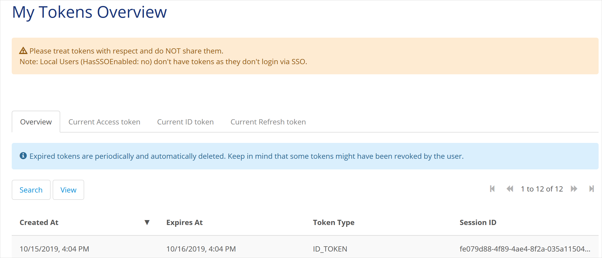

## 1 Introduction

The [MendixSSO module](https://appstore.home.mendix.com/link/app/111349/) comes with a default implementation of end-user administration. This is described in [Mendix Single Sign-on](mendix-sso).

The default administration module is sufficient for most apps. However, you can create your own administration module if you want to do things in a different way.

This document also contains some more technical information about the Mendix SSO implementation to help you with modifying the administration module and debugging any issues with Mendix SSO.

## 2 Customizing Mendix SSO

There are two ways you can modify the MendixSSO module. You can use snippets from the App Store module MendixSSO in your pages, or you can modify the MendixSSO module in any way you like to support your end-user administration requirements.

These two ways are described below.

### 2.1 Using Snippets

The default Mendix SSO implementation is based on snippets. You can use these snippets in your own pages to customize the administration of the end-users. If you look at how they are used in the default implementation, you can see how to use them in your own pages. The snippets are:

* In folder **Admin**
    * **TokensOverviewSnippet** – an overview of all the tokens issued to end-users of the app
    * **UserOverviewSnippet** – an overview of all the end-users who have used the app. This will not include end-users who have been given access through the developer portal but have not yet signed in
    * **UserViewEditSnippet** – a page where details of an end-user can be seen and, where the current end-user has access, edited
* In folder **Common**
    * **AccountDetailsNotEditableSnippet** – text explaining that details of SSO end-users come from Mendix and are not editable in the app
    * **EnvironmentCredentialsSecurityWarningSnippet** – text warning that sharing credentials is a security risk
    * **TokensAreExpiredPeriodicallySnippet** – text explaining that expired tokens are deleted automatically after a period of time
    * **TokenSecurityWarningSnippet** – text explaining that tokens give access to the app for SSO end-users, and that local end-users will not have tokens
    * **TokenViewSnippet** – displays details of a token
* In folder **User**
    * **MyAccountDetailsSnippet** – a page where details of an end-user can be seen—similar to **UserViewEditSnippet** but without the additional administration capabilities
    * **MyTokensOverviewSnippet** – an overview of all the tokens issued to the current end-user of the app

### 2.2 Modifying Mendix SSO

{}
We recommend that you do not modify the version of MendixSSO which is in the App Store modules section of your project. In future, you may wish to import a newer version of the module and this will overwrite any changes you make.
{}

The MendixSSO module is written so that you can make a complete copy of the module and use this as the basis of a new administration module.

To make a copy of the module, do the following:

{}[WHAT IS THE BEST WAY TO DO THIS?]{}

## 3 Tokens

Mendix SSO works by providing end-users with tokens when they are authenticated. If end-users are having issues with Mendix SSO it can be useful to see the tokens, either for your own debugging or to provide information to Mendix Support.

The default Mendix SSO administration module has a number of pages set up to enable you to see tokens. Alternatively, you can use snippets from the default module to create your own token display and administration pages.

{}
Tokens contain personal information, as well as authentication information. They should not be exposed routinely, and should only be shared on a need-to-know basis (for example, if you need help resolving an issue with SSO).
{}

### 3.1 Displaying Tokens on Pages

Individual end-users can see their tokens on the MendixSSO.MyTokensOverview page of the default implementation. Administrators may want to see all active tokens – these can be seen on the MendixSSO.TokensOverview page.

If you want administrators or end-users to be able to see tokens, it is recommended that you add these to the navigation of the app. This avoids them being included in the main process flows of the app.

#### 3.1.1 TokensOverview Page

The TokensOverview page allows administrators to see all tokens which have been issued to end-users of the app.

The page can be used for troubleshooting – you can see the creation and expiry dates of the tokens and, by clicking **View**, you can view the values held in the tokens.

The **ID Token** is held in jwt format, so you can paste it into a [jwt decoder](https://jwt.io) to confirm what information it holds.

The page can also be used for administration. You can delete tokens which have expired, and you can also delete current tokens if they are causing unwanted issues.

Deleting tokens from the TokensOverview page will cause end-users to lose access to the app. However, they will be able to sign in again if they are still end-users of the app.

#### 3.1.2 MyTokensOverview Page

The MyTokensOverview page allows end-users to see their own access tokens.

The page can be used for troubleshooting – the end-user can see the creation and expiry dates of the tokens and, by clicking **View**, they can view the values held in the tokens. This can be useful for troubleshooting if the end-user is having difficulty getting proper access to the app.

### 3.2 Displaying Tokens using Snippets

The default tokens pages in the Mendix SSO module are created using snippets.

You can use these snippets to create your own token administration pages. Look at the pages in the default administration module for ideas on how they can be used.
