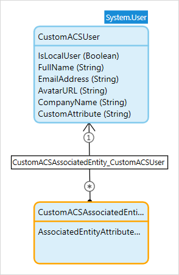

## 1 Introduction

The AppCloudServices implementation of single sign on (SSO) for Mendix has been deprecated. The [MendixSSO module](https://appstore.home.mendix.com/link/app/111349/) can replace this implementation completely. It comes with a default implementation of user administration which gives you all the tools you need to manage SSO as described in [Mendix Single Sign-on](mendix-sso).

MendixSSO has been designed to easily replace the AppCloudServices SSO. How to do this depends on how AppCloudServices was implemented in your app. There are two different situations:

* AppCloudServices was implemented with no additional customization
* The AppCloudServices domain model has been enhanced with additional attributes and/or associations

Dealing with these to situations is described in the two sections below.

## 2 Replacing a Standard Implementation of AppCloudServices with Mendix SSO

If you have an app which uses AppCloudServices in its default implementation then you can just replace the existing AppCloudServices App Store module, with the MendixSSO App Store module.

Perform the following steps to replace AppCloudServices with MendixSSO.

1. MendixSSO apps must be built using Mendix version 7.23.3 or above. If your app is built using Mendix version 7.23.2 or below, you need to upgrade it. Apps in a previous version 7 release of Mendix can be updated automatically by opening them in a new version of Studio Pro. Apps in version 6 of Mendix will need to be updated to version 7 first – see the instructions in [Moving from Modeler Version 6 to 7](/refguide7/moving-from-6-to-7).

2. Upgrade your UI to AtlasUI. MendixSSO pages are written using AtlasUI, so to make use of the default MendixSSO implementation, you need to upgrade your app. See the instructions in [How To Migrate Existing App Projects to Atlas UI](/howto/front-end/migrate-existing-projects-to-atlasui).

3. Import the MendixSSO module from the App Store, and implement it using the instructions in the [Setting Up Mendix Single Sign-On](mendix-sso#setting-up) section of *Mendix Single Sign-On*.

4. Delete the **AppCloudServices** module. You will also need to delete or exclude the **OnFirstLoginAppCloudUser** microflow which will have been added to your app.

5. If you had local users who had access to the app, these will still be available through the **Account** entity in the **Administration** App Store Module. You can continue to administer these users through the Administration module

    If you wish, you can copy the information about local users into the **MendixSSOUser** entity in the MendixSSO module. If you do this, you will need to use the same techniques as described for customized implementations in the next section.

6. Deploy your app to the Mendix Cloud.

{}
You have now upgraded your app to use the MendixSSO module. Because all the end-user information and credentials are held in their Mendix account, they are already known to the app and can continue to use it as before.
{}

## 3 Replacing a Customized Implementation of AppCloudServices with Mendix SSO

If you have modified the domain model for AppCloudServices single sign-on, and you want to keep this information, then you will need to take some extra steps.

For example, say you have added an attribute, **CustomAttribute** to the user information which you are managing through the **CustomACSUser** entity. Additionally, you have associated the **CustomACSAssociatedEntity** entity which contain more information.

This is information which is not available from the Mendix Developer Portal, so if you just delete the AppCloudServices implementation, you will lose this extra information about the users. To keep it, you need to ensure that the information is copied across. This is described below.

### 3.1 Adding Mendix SSO to Your App

The first steps you need to take are the same as for a non-customized implementation:

1. MendixSSO apps must be built using Mendix version 7.23.3 or above. If your app is built using Mendix version 7.23.2 or below, you need to upgrade it. Apps in a previous version 7 release of Mendix can be updated automatically by opening them in a new version of Studio Pro. Apps in version 6 of Mendix will need to be updated to version 7 first – see the instructions in [Moving from Modeler Version 6 to 7](/refguide7/moving-from-6-to-7).

2. Upgrade your UI to AtlasUI. MendixSSO pages are written using AtlasUI, so to make use of the default MendixSSO implementation, you need to upgrade your app. See the instructions in [How To Migrate Existing App Projects to Atlas UI](/howto/front-end/migrate-existing-projects-to-atlasui).

3. Import the MendixSSO module from the App Store, and implement it using the instructions in the [Setting Up Mendix Single Sign-On](mendix-sso#setting-up) section of *Mendix Single Sign-On*.

### 3.2 Copying Data from AppCloudServices Users to Mendix SSO Users

Now you need to set up a second, customized version of the Mendix SSO module which has the same modifications as the AppCloudServices implementation.

1. Create a new MendixSSO module, but importing it from the App Store and using the option 

    

2. You will get errors because of duplicate names for the services created in the module. Exclude the duplicate services in the new module from your project. You will also need to clear any other errors by excluding microflows which refer to these services.

    

3. In the new MendixSSO module, add the custom attributes used in the ACS user entity and add associations to any related entities. Ensure that the associations have the correct type and direction.

    

4. In the original ACS SSO domain model, ensure that deleting the user will not delete the associated entities.

    

