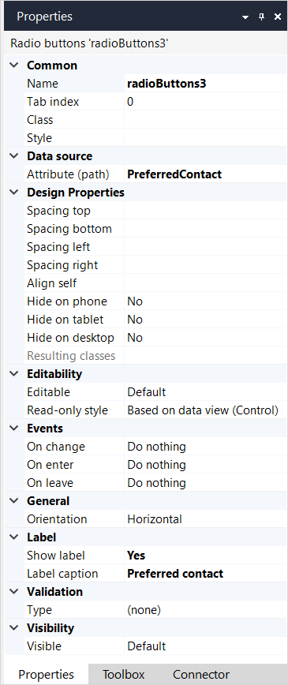

## 1 Introduction

{}The radio buttons widget is not supported on native mobile pages.{}

**Radio Buttons** are used to display and, optionally, allow the end-user to edit the value of an attribute of [data type](data-types) *Boolean* or *Enumeration*.

When the page is displayed to the end-user, all the possible values are listed, with a filled-in circle next to the selected value and an empty circle next to the unselected value(s). Only one value can be chosen – choosing another value deselects the current value. For example:

Radio buttons must be placed in a [data widget](data-widgets) and display an attribute of the object(s) retrieved by that widget. The name of the attribute to be displayed is shown inside the text box, between square brackets, and colored blue.

For example, the following image contains two sets of radio buttons.  The first allows the end-user to see, and set, the value of an enumeration identifying the preferred time to contact this person (**PreferredContact**). The second allows the end-user to see, and set, a Boolean indicating whether this is a **Personal** contact.

## 2 Properties

An example of text box properties is represented in the image below:

{}
{}

Text box properties consist of the following sections:

* [Common](#common)
* [Data source](#data-source)
* [Design Properties](#design-properties)
* [Editability](#editability)
* [Events](#events)
* [General](#general)
* [Label](#label)
* [Validation](#validation)
* [Visibility](#visibility)

### 2.1 Common Section{#common}

{}

### 2.2 Data Source Section{#data-source}

{}

### 2.3 Design Properties Section{#design-properties}

{} 

### 2.4 Editability Section{#editability}

{}

### 2.5 Events Section{#events}

#### 2.5.1 On Change{#on-change}

The on-change property specifies an action that will be executed when leaving the widget, either by using the <kbd>Tab</kbd> key or by clicking another widget, after the value has been changed.

{}

#### 2.5.2 On Enter

The on-enter property specifies an action that will be executed when the widget is entered, either by using the <kbd>Tab</kbd> key or by clicking it with the mouse.

{}

#### 2.5.3 On Leave

The on-leave property specifies an action that will be executed when leaving the widget, either by using the <kbd>Tab</kbd> key or by clicking another widget.

This differs from the [On change](#on-change) property in that the event will always be triggered, even if the value has not been changed.

{}

### 2.6 General Section{#general}

#### 2.6.1 Orientation

This property defines whether the radio buttons are rendered as a **Horizontal** or **Vertical** list.

_Default value:_ Horizontal

### 2.7 Label Section{#label}

{}

### 2.8 Validation Section{#validation}

{}

### 2.9 Visibility Section{#visibility}

{}

## Read More

*   [Data view](data-view)
*   [Attributes](attributes)
